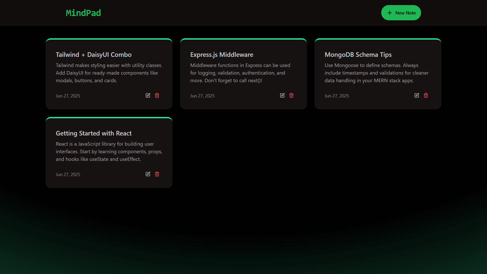
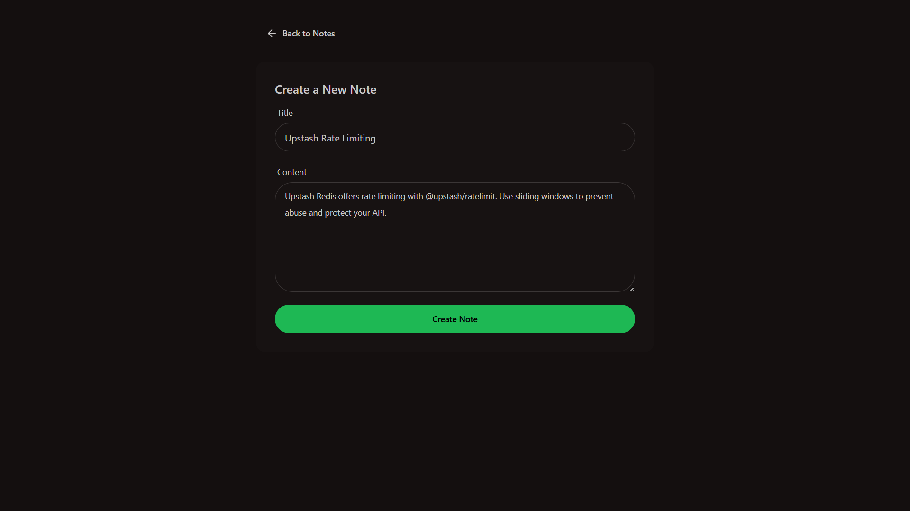
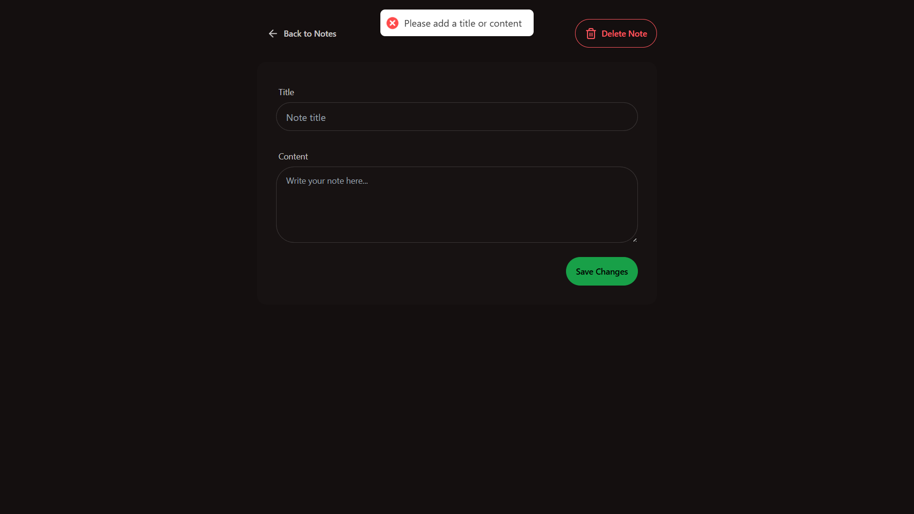

# 🧠 MindPad

MindPad is a full-stack note-taking application built with the **MERN stack** (MongoDB, Express.js, React, Node.js). It lets users create, read, update, and delete notes with a clean, responsive UI powered by **Tailwind CSS** and **DaisyUI**. The app also includes **rate limiting** via Upstash Redis and toast notifications for better UX.

---

## 🚀 Features

- 📄 CRUD operations for notes
- ⚛️ Frontend built with React + Vite
- 🧩 Tailwind CSS + DaisyUI for responsive UI
- 🔔 Toast notifications using `react-hot-toast`
- 📦 Backend API with Express.js and MongoDB
- 🔒 Basic rate limiting with Upstash Redis
- 🛠 Organized code structure (MVC pattern)

---

## 🧱 Tech Stack

**Frontend:**
- React (via Vite)
- React Router
- Tailwind CSS
- DaisyUI
- react-hot-toast

**Backend:**
- Node.js
- Express.js
- MongoDB with Mongoose
- Upstash Redis (`@upstash/ratelimit`)
- dotenv

---

## 📁 Project Structure

```
mern-mindpad/
├── backend/
│   ├── controllers/
│   ├── models/
│   ├── routes/
│   ├── middleware/
│   └── config/
├── frontend/
│   ├── src/
│   │   ├── components/
│   │   ├── pages/
│   │   ├── App.jsx
│   │   └── main.jsx
├── README.md
└── package.json
```

---

## 🛠 Installation & Setup

### 1. Clone the repo
```bash
git clone https://github.com/prosenjeetshil/mern-mindpad.git
cd mern-mindpad
```

### 2. Setup Backend
```bash
cd backend
npm install
```

Create a `.env` file in `/backend`:
```
PORT=5001
MONGO_URI=your_mongodb_uri
UPSTASH_REDIS_REST_URL=your_redis_url
UPSTASH_REDIS_REST_TOKEN=your_redis_token
```

Start backend server:
```bash
npm run dev
```

### 3. Setup Frontend
```bash
cd ../frontend
npm install
npm run dev
```

---

## 🖼️ Screenshots
✅ Home Page


📝 Create Note


🔔 Toast Notification


---

## 📌 Todo (Next Steps)

- Add authentication (JWT, OAuth, etc.)
- Add note categories/tags
- Save notes per user
- Dark/light theme toggle
- Deploy with Render / Vercel / Netlify

---

## 🤝 Contributing

This is a solo project for learning purposes, but contributions or suggestions are welcome! Feel free to fork and submit a PR.

---

